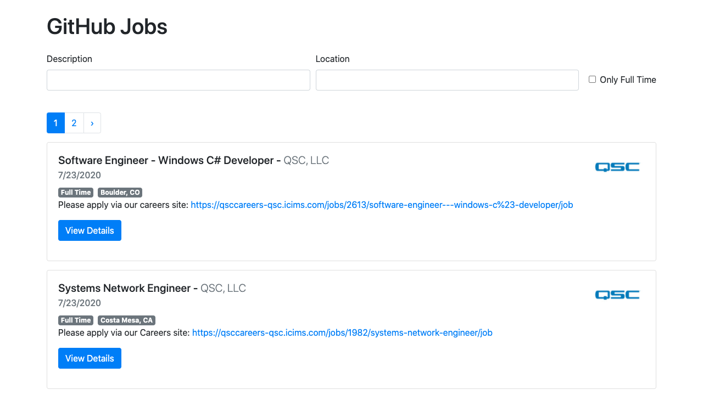

# Github-Jobs
This project was bootstrapped with [Create React App](https://github.com/facebook/create-react-app).

## Usage

Follow the instructions below:

```sh
Firstly, clone/download the repo and install the necessary dependencies (yarn or npm install --save).

Secondly, run the application!

```
## Results
After running the app and accessing the url (localhost:3000). You can search for Jobs that are available from Github Jobs in America.




## Licensed under the [MIT](https://raw.githubusercontent.com/hasimy-as/My-Resume/master/LICENSE) License.

Happy coding!
~Hasimy